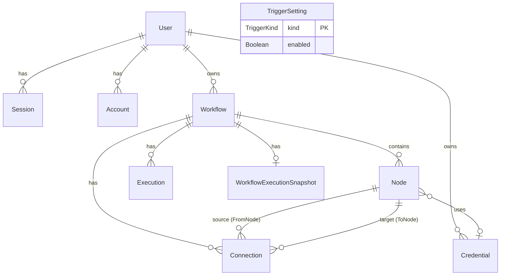

# Database Documentation

## 1. Overview

| Property | Value |
|---|---|
| Database | PostgreSQL 14+ |
| ORM | Prisma v7 |
| Driver | `@prisma/adapter-pg` (native pg driver) |
| Schema file | `frontend/prisma/schema.prisma` |
| Generated client | `frontend/generated/prisma/` |
| Migrations | `frontend/prisma/migrations/` |

---

## 2. Entity-Relationship Diagram



---

## 3. Table Reference

### `user`
Platform user accounts.

| Column | Type | Constraints | Description |
|---|---|---|---|
| `id` | String | PK, CUID | User identifier |
| `email` | String | UNIQUE, NOT NULL | Login email |
| `name` | String | Nullable | Display name |
| `emailVerified` | Boolean | DEFAULT false | Email verification flag |
| `image` | String | Nullable | Avatar URL |
| `role` | UserRole | DEFAULT USER | `USER` or `ADMIN` |
| `banned` | Boolean | DEFAULT false | Whether account is banned |
| `banReason` | String | Nullable | Reason for ban |
| `banExpires` | DateTime | Nullable | Ban expiry (null = permanent) |
| `createdAt` | DateTime | DEFAULT now() | |
| `updatedAt` | DateTime | @updatedAt | |

**Relations**: has many `Session`, `Account`, `Workflow`, `Credential`.

---

### `session`
better-auth session records (one per active login).

| Column | Type | Constraints | Description |
|---|---|---|---|
| `id` | String | PK | |
| `expiresAt` | DateTime | NOT NULL | |
| `token` | String | UNIQUE | |
| `createdAt` | DateTime | | |
| `updatedAt` | DateTime | | |
| `ipAddress` | String | Nullable | |
| `userAgent` | String | Nullable | |
| `impersonatedBy` | String | Nullable | Admin impersonation audit |
| `userId` | String | FK → user.id, CASCADE | |

**Indexes**: `userId`.

---

### `account`
OAuth provider account links (also stores password hash for email/password auth).

| Column | Type | Constraints | Description |
|---|---|---|---|
| `id` | String | PK | |
| `accountId` | String | | Provider-specific account ID |
| `providerId` | String | | `credential` for email/password |
| `userId` | String | FK → user.id, CASCADE | |
| `accessToken` | String | Nullable | |
| `refreshToken` | String | Nullable | |
| `idToken` | String | Nullable | |
| `accessTokenExpiresAt` | DateTime | Nullable | |
| `refreshTokenExpiresAt` | DateTime | Nullable | |
| `scope` | String | Nullable | |
| `password` | String | Nullable | Argon2/bcrypt hash for email/password |
| `createdAt` | DateTime | | |
| `updatedAt` | DateTime | | |

**Indexes**: `userId`.

---

### `verification`
Stores tokens for email verification and password reset flows.

| Column | Type | Constraints | Description |
|---|---|---|---|
| `id` | String | PK | |
| `identifier` | String | | Email or user ID being verified |
| `value` | String | | The token value |
| `expiresAt` | DateTime | | |
| `createdAt` | DateTime | | |
| `updatedAt` | DateTime | | |

**Indexes**: `identifier`.

---

### `credential`
Encrypted API keys stored by users.

| Column | Type | Constraints | Description |
|---|---|---|---|
| `id` | String | PK, CUID | |
| `name` | String | NOT NULL | User-assigned display name |
| `value` | String | NOT NULL | AES-encrypted API key |
| `type` | CredentialType | NOT NULL | `OPENAI`, `ANTHROPIC`, `GEMINI`, `DISCORD`, or `SLACK` |
| `createdAt` | DateTime | DEFAULT now() | |
| `updatedAt` | DateTime | @updatedAt | |
| `userId` | String | FK → user.id, CASCADE | |

**Relations**: belongs to `User`, has many `Node` (nodes that reference this credential).

> **Important**: The `value` column stores ciphertext produced by Cryptr. Never insert plaintext API keys directly.

---

### `workflow`
User-created workflow definitions.

| Column | Type | Constraints | Description |
|---|---|---|---|
| `id` | String | PK, CUID | |
| `name` | String | NOT NULL | Human-readable name (random slug on creation) |
| `userId` | String | FK → user.id, CASCADE | |
| `createdAt` | DateTime | DEFAULT now() | |
| `updatedAt` | DateTime | @updatedAt | |

**Relations**: has many `Node`, `Connection`, `Execution`; has one `WorkflowExecutionSnapshot`.

---

### `node`
Individual nodes within a workflow.

| Column | Type | Constraints | Description |
|---|---|---|---|
| `id` | String | PK, CUID | |
| `workflowId` | String | FK → workflow.id, CASCADE | |
| `name` | String | NOT NULL | Node display name |
| `type` | NodeType | NOT NULL | Enum: INITIAL, MANUAL_TRIGGER, etc. |
| `position` | Json | NOT NULL | `{ x: number, y: number }` canvas position |
| `data` | Json | DEFAULT `{}` | Node configuration data (prompts, URLs, etc.) |
| `credentialId` | String | Nullable, FK → credential.id | Assigned credential |
| `createdAt` | DateTime | | |
| `updatedAt` | DateTime | | |

**Relations**: belongs to `Workflow`; optionally belongs to `Credential`; has many `Connection` as source and target.

**`data` column shape by node type:**

| NodeType | `data` fields |
|---|---|
| `MANUAL_TRIGGER` | `{}` |
| `HTTP_REQUEST` | `{ variableName, endpoint, method, body }` |
| `GOOGLE_FORM_TRIGGER` | `{ formId?, formIdClaimedAt? }` |
| `STRIPE_TRIGGER` | `{}` |
| `ANTHROPIC` | `{ variableName, credentialId, systemPrompt, userPrompt }` |
| `GEMINI` | `{ variableName, credentialId, systemPrompt, userPrompt }` |
| `OPENAI` | `{ variableName, credentialId, systemPrompt, userPrompt }` |
| `DISCORD` | `{ variableName, webhookUrl, aiSourceVariable, username?, content? (legacy) }` |
| `SLACK` | `{ variableName, webhookUrl, content }` |

---

### `connection`
Directed edges between workflow nodes.

| Column | Type | Constraints | Description |
|---|---|---|---|
| `id` | String | PK, CUID | |
| `workflowId` | String | FK → workflow.id, CASCADE | |
| `fromNodeId` | String | FK → node.id, CASCADE | Source node |
| `toNodeId` | String | FK → node.id, CASCADE | Target node |
| `fromOutput` | String | DEFAULT `"main"` | Named output handle |
| `toInput` | String | DEFAULT `"main"` | Named input handle |
| `createdAt` | DateTime | | |
| `updatedAt` | DateTime | | |

**Unique constraint**: `(fromNodeId, toNodeId, fromOutput, toInput)` — prevents duplicate edges.

---

### `execution`
Workflow run records.

| Column | Type | Constraints | Description |
|---|---|---|---|
| `id` | String | PK, CUID | |
| `workflowId` | String | FK → workflow.id, CASCADE | |
| `status` | ExecutionStatus | DEFAULT RUNNING | `RUNNING`, `SUCCESS`, or `FAILED` |
| `error` | String (Text) | Nullable | Error message on failure |
| `errorStack` | String (Text) | Nullable | Stack trace on failure |
| `startedAt` | DateTime | DEFAULT now() | |
| `completedAt` | DateTime | Nullable | Set on SUCCESS or FAILED |
| `inngestEventId` | String | UNIQUE | Inngest event ID for correlation |
| `output` | Json | Nullable | Final execution context |

---

### `workflow_execution_snapshot`
One-to-one per workflow; stores the most recent execution phase and per-node status for polling fallback.

| Column | Type | Constraints | Description |
|---|---|---|---|
| `workflowId` | String | PK, FK → workflow.id, CASCADE | |
| `phase` | String | DEFAULT `"idle"` | `idle`, `running`, `completed`, or `failed` |
| `nodeStatuses` | Json | DEFAULT `{}` | `Record<nodeId, { status, nodeType? }>` |
| `updatedAt` | DateTime | @updatedAt | |

**Purpose**: The canvas polls this endpoint every 1 second as a fallback if the WebSocket channel drops. The Inngest realtime publisher keeps this table in sync alongside pushing WebSocket events.

---

### `trigger_setting`
Admin-managed per-trigger kill switches.

| Column | Type | Constraints | Description |
|---|---|---|---|
| `kind` | TriggerKind | PK | `MANUAL`, `GOOGLE_FORM`, or `STRIPE` |
| `enabled` | Boolean | DEFAULT true | Whether this trigger kind is globally active |
| `updatedAt` | DateTime | @updatedAt | |

**Default behavior**: If no row exists for a given `kind`, it defaults to `enabled = true` in application code.

---

## 4. Enums

```prisma
enum UserRole      { USER  ADMIN }
enum TriggerKind   { MANUAL  GOOGLE_FORM  STRIPE }
enum CredentialType { OPENAI  ANTHROPIC  GEMINI  DISCORD  SLACK }
enum ExecutionStatus { RUNNING  SUCCESS  FAILED }
enum NodeType {
  INITIAL  MANUAL_TRIGGER  HTTP_REQUEST
  GOOGLE_FORM_TRIGGER  STRIPE_TRIGGER
  ANTHROPIC  GEMINI  OPENAI  DISCORD  SLACK
}
```

---

## 5. Key Relationships

```
User 1──* Workflow 1──* Node
                    1──* Connection  (fromNode + toNode both reference Node)
                    1──* Execution
                    1──0|1 WorkflowExecutionSnapshot

User 1──* Credential 0|1──* Node  (credentialId on Node)

TriggerSetting (standalone; no FK to User)
```

---

## 6. Constraints and Indexes

| Table | Constraint / Index | Columns | Purpose |
|---|---|---|---|
| `user` | UNIQUE | `email` | Login uniqueness |
| `session` | UNIQUE | `token` | Session token lookup |
| `session` | INDEX | `userId` | Fast session queries per user |
| `account` | INDEX | `userId` | Fast account queries per user |
| `verification` | INDEX | `identifier` | Token lookup by email/id |
| `connection` | UNIQUE | `(fromNodeId, toNodeId, fromOutput, toInput)` | No duplicate edges |
| `execution` | UNIQUE | `inngestEventId` | One execution record per Inngest event |

---

## 7. Data Lifecycle

| Model | Created | Deleted |
|---|---|---|
| User | On signup | Via admin panel (`auth.api.removeUser`) |
| Session | On sign-in | On sign-out or expiry |
| Workflow | On create button (Pro) | On delete by owner |
| Node | During workflow update/save | When workflow is deleted (cascade) or workflow save (delete+recreate) |
| Connection | During workflow save | Same as Node |
| Credential | On create (Pro) | On delete by owner |
| Execution | At start of Inngest function | Never (historical log; cascade-deleted with workflow) |
| WorkflowExecutionSnapshot | On first execution | Cascade-deleted with workflow |
| TriggerSetting | Via admin trigger update | Never deleted (updated by kind PK) |

---

## 8. Migration History

| Migration | Date | Description |
|---|---|---|
| `20260329170634_init` | 2026-03-29 | Initial schema: User, Session, Account, Verification |
| `20260411192739_added_auth_model` | 2026-04-11 | Auth model adjustments for better-auth |
| `20260414172239_workflows_table` | 2026-04-14 | Add Workflow model |
| `20260502101354_workflow_updated` | 2026-05-02 | Workflow schema updates |
| `20260505180308_react_flow_tables` | 2026-05-05 | Add Node and Connection models |
| `20260507041227_added_nodetype` | 2026-05-07 | Add NodeType enum |
| `20260518042148_google_form_trigger_node` | 2026-05-18 | Add GOOGLE_FORM_TRIGGER node type |
| `20260520053716_add_workflow_execution_snapshot` | 2026-05-20 | Add WorkflowExecutionSnapshot |
| `20260520074036_add_stripe_trigger_node_type` | 2026-05-20 | Add STRIPE_TRIGGER node type |
| `20260520074945_ai_node_added` | 2026-05-20 | Add ANTHROPIC, GEMINI, OPENAI node types |
| `20260520174103_creadential_added` | 2026-05-20 | Add Credential model |
| `20260520180610_add_discord_slack_node` | 2026-05-20 | Add DISCORD, SLACK node types |
| `20260520182836_add_discord_slack_node_types` | 2026-05-20 | Discord/Slack node type adjustments |
| `20260520184448_added_execution_history_model` | 2026-05-20 | Add Execution model |
| `20260521120000_admin_panel` | 2026-05-21 | Add TriggerSetting model, UserRole enum |

---

## 9. Migration Strategy

### Development
```bash
# Create and apply a new migration
pnpm db:migrate --name describe_the_change

# View the schema in a browser UI
pnpm db:studio
```

### Production
```bash
# Apply pending migrations without prompts
npx prisma migrate deploy
```

### Rules
- Never edit a migration file after it has been committed; create a new migration instead.
- Always run `pnpm db:generate` after schema changes to regenerate the Prisma client.
- The `migration_lock.toml` file records the provider; do not change it manually.

---

## 10. Seeding

`prisma/seed.ts` is run by `pnpm db:seed`. It currently seeds default `TriggerSetting` rows for all three trigger kinds (enabled by default).

```bash
pnpm db:seed
```

The admin bootstrap script (`scripts/bootstrap-admin.ts`) promotes a user to ADMIN by email. Run it separately after the first user signs up:
```bash
npx tsx scripts/bootstrap-admin.ts
```
