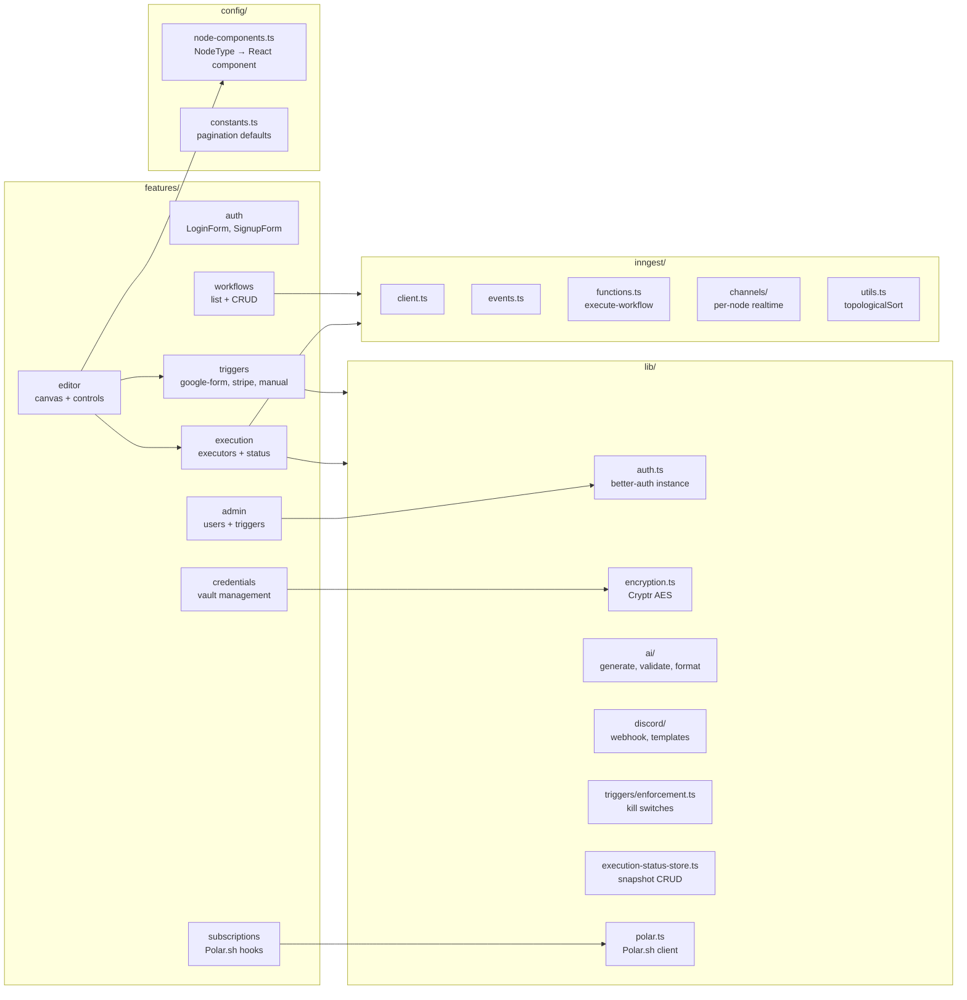
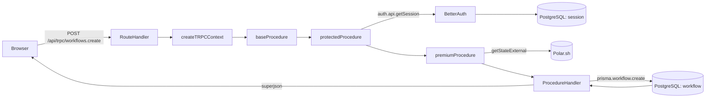

# Architecture Diagram

## System Component Map

```mermaid
graph TB
    subgraph Browser
        UI[React 19 + React Flow Canvas]
        TQ[TanStack Query Cache]
        RT[Inngest Realtime useRealtime hook]
        Jotai[Jotai atoms]
    end

    subgraph NextJS["Next.js 16 App (frontend/)"]
        direction TB
        subgraph Routes["App Router Routes"]
            Pages[Pages: /workflows, /credentials, /executions, /admin]
            tRPCHandler[/api/trpc/[trpc]]
            AuthHandler[/api/auth/[...all]]
            InngestHandler[/api/inngest]
            Webhooks[/api/webhooks/google-form<br/>/api/webhooks/stripe]
            PollAPI[/api/workflows/[id]/execution-status]
        end

        subgraph API["API Layer"]
            tRPCRouter[tRPC Router<br/>workflows, credentials, executions, admin]
            BetterAuth[better-auth<br/>sessions + roles]
        end

        subgraph Services["Business Logic"]
            WorkflowService[Workflow Logic<br/>topologicalSort, sendExecution]
            CredService[Credential Encryption<br/>encrypt/decrypt]
            TriggerEnforce[Trigger Enforcement]
            AdminService[Admin Services<br/>user + trigger management]
        end

        subgraph Inngest_Local["Inngest Function"]
            ExecFn[execute-workflow<br/>durable function]
            Executors[Node Executors<br/>openai, anthropic, gemini,<br/>discord, slack, http]
            Publisher[Realtime Publisher<br/>publishNodeStatus]
        end
    end

    subgraph External["External Services"]
        InngestCloud[Inngest Cloud<br/>Function queue + Realtime]
        PolarSh[Polar.sh<br/>Subscriptions]
        PostgreSQL[(PostgreSQL)]
        OpenAI[OpenAI API]
        AnthropicAPI[Anthropic API]
        GeminiAPI[Google Gemini API]
        DiscordAPI[Discord Webhooks]
        SlackAPI[Slack Webhooks]
        Stripe[Stripe]
        GoogleForms[Google Forms]
    end

    %% Browser to Next.js
    UI -->|tRPC mutations/queries| tRPCHandler
    UI -->|auth calls| AuthHandler
    RT -->|WebSocket| InngestCloud
    UI -->|HTTP poll| PollAPI

    %% Next.js internal
    tRPCHandler --> tRPCRouter
    tRPCRouter --> WorkflowService
    tRPCRouter --> CredService
    tRPCRouter --> AdminService
    AuthHandler --> BetterAuth
    InngestHandler --> ExecFn
    Webhooks --> TriggerEnforce
    Webhooks --> WorkflowService

    %% Inngest execution
    WorkflowService -->|send event| InngestCloud
    InngestCloud -->|invoke| ExecFn
    ExecFn --> Executors
    Executors --> Publisher
    Publisher -->|publish| InngestCloud
    Publisher -->|upsert snapshot| PostgreSQL

    %% DB connections
    tRPCRouter -->|Prisma| PostgreSQL
    BetterAuth -->|Prisma| PostgreSQL
    ExecFn -->|Prisma| PostgreSQL
    TriggerEnforce -->|Prisma| PostgreSQL
    PollAPI -->|Prisma| PostgreSQL

    %% External service calls
    tRPCRouter -->|subscription check| PolarSh
    Executors -->|generateText| OpenAI
    Executors -->|generateText| AnthropicAPI
    Executors -->|generateText| GeminiAPI
    Executors -->|POST webhook| DiscordAPI
    Executors -->|POST webhook| SlackAPI
    Stripe -->|POST webhook| Webhooks
    GoogleForms -->|POST webhook| Webhooks
```

---

## Feature Module Map



---

## Request Flow (tRPC Mutation)



---

## Execution Status Dual-Path

```mermaid
flowchart TB
    Inngest[Inngest Function<br/>publishNodeStatus]
    
    subgraph DualPath["Dual delivery path"]
        WS[Inngest Realtime<br/>WebSocket channel]
        DB[(WorkflowExecutionSnapshot<br/>PostgreSQL)]
    end

    subgraph Browser_sub["Browser"]
        useRealtime[useRealtime hook<br/>WebSocket path]
        Polling[Polling fallback<br/>1s interval HTTP]
        Canvas[Canvas State<br/>syncNodeStatus]
    end

    Inngest -->|publish event| WS
    Inngest -->|upsert snapshot| DB

    WS -->|delta messages| useRealtime
    DB -->|GET /execution-status| Polling

    useRealtime --> Canvas
    Polling --> Canvas
