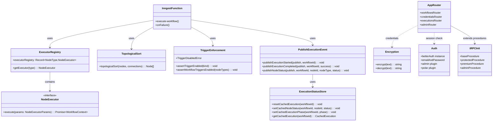
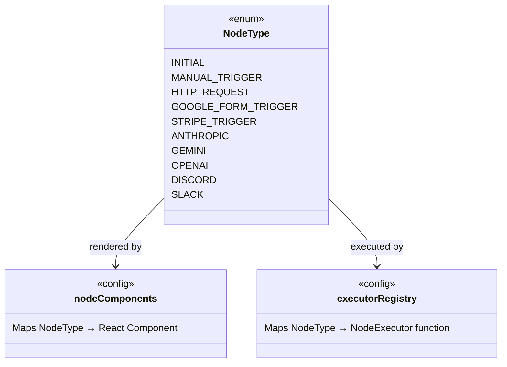

# Module Dependency Diagram

> For full implementation details, see **[../backend.md](../backend.md)** and **[../frontend.md](../frontend.md)**.

## Core Module Dependencies

## Node Type Relationships

