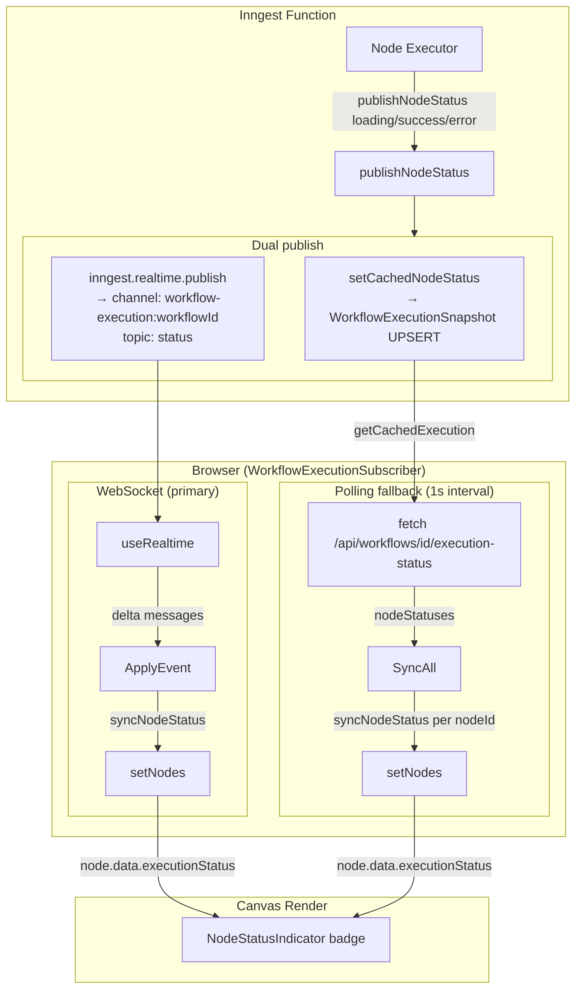

# Data Flow Diagrams

## 1. Workflow Execution Context Flow

This diagram shows how data flows through a typical workflow with Google Form trigger → OpenAI → Discord.

```mermaid
flowchart TD
    subgraph Init["Initialization"]
        WebhookIn[POST /api/webhooks/google-form] -->|parse body| FormData
        FormData -->|initialData.googleForm| Context0
    end

    subgraph Node1["Node 1: GOOGLE_FORM_TRIGGER (passthrough)"]
        Context0[context = { googleForm: {...} }] --> GFT
        GFT[googleFormTriggerExecutor] -->|returns context unchanged| Context1
        Context1[context = { googleForm: {...} }]
    end

    subgraph Node2["Node 2: OPENAI"]
        Context1 -->|Handlebars: {{json googleForm}}| PromptRender
        PromptRender[Rendered user prompt] --> OpenAI_Call
        OpenAI_Call[generateDiscordAiOutput<br/>model: gpt-4o-mini] -->|structured output| AIResult
        AIResult[TeacherFeedback object +<br/>formatted message string] -->|stored as context.myAiOutput| Context2
        Context2[context = {<br/>googleForm: {...},<br/>myAiOutput: {<br/>text: 'formatted message',<br/>structured: {teacher_name, rating_out_of_10, ...}<br/>}<br/>}]
    end

    subgraph Node3["Node 3: DISCORD"]
        Context2 -->|read context.myAiOutput.text| Validate
        Validate[validateAndExtractDiscordMessage] -->|valid message| WebhookPost
        WebhookPost[sendDiscordWebhook<br/>POST to webhook URL] -->|success| DiscordResult
        DiscordResult[{ messageContent: 'posted text' }] -->|stored as context.discordOut| Context3
        Context3[Final context = {<br/>googleForm: {...},<br/>myAiOutput: {...},<br/>discordOut: { messageContent: '...' }<br/>}]
    end

    Context3 -->|Execution.output| Database[(PostgreSQL)]
```

---

## 2. Credential Data Flow

```mermaid
flowchart LR
    subgraph Creation["Credential Creation (browser → DB)"]
        User[User types API key] -->|plaintext| Form
        Form -->|trpc.credentials.create| Server
        Server -->|encrypt with ENCRYPTION_KEY| Cryptr
        Cryptr -->|ciphertext| DB[(PostgreSQL: credential.value)]
    end

    subgraph Usage["Credential Usage (DB → AI provider)"]
        InngestFn[Inngest executor] -->|prisma.credential.findUnique| DB2[(PostgreSQL)]
        DB2 -->|ciphertext| Decrypt
        Decrypt -->|decrypt with ENCRYPTION_KEY| APIKey[Plaintext API key]
        APIKey -->|createOpenAI({apiKey})| AI[OpenAI / Anthropic / Gemini]
    end
```

---

## 3. Canvas State Data Flow

```mermaid
flowchart TD
    subgraph Server["Server (PostgreSQL)"]
        WfDb[(workflow + nodes + connections)]
    end

    subgraph Fetch["Data Fetching"]
        WfDb -->|trpc.workflows.getOne| Transform
        Transform[Transform DB → React Flow format:<br/>node.position JSON → {x,y}<br/>connection → {source, target, handles}] --> InitState
    end

    subgraph Canvas["Editor Component State"]
        InitState[nodes: Node[], edges: Edge[]] -->|useState| CanvasState
        CanvasState[React Flow local state] -->|user drags nodes| ApplyChanges
        ApplyChanges[applyNodeChanges / applyEdgeChanges / addEdge] --> CanvasState
    end

    subgraph Save["Canvas Save"]
        CanvasState -->|user clicks Save| Mutation
        Mutation[trpc.workflows.update.mutate] -->|transaction| DB2[(Delete + recreate nodes + connections)]
    end
```

---

## 4. Real-time Status Data Flow



---

## 5. Authentication Data Flow

```mermaid
flowchart LR
    subgraph SignIn["Sign In"]
        Browser_si[Browser] -->|POST /api/auth/sign-in/email<br/>{email, password}| BetterAuth
        BetterAuth -->|verify password| Account[(account.password hash)]
        BetterAuth -->|create session| Session[(session table)]
        BetterAuth -->|Set-Cookie: session_token| Browser_si
    end

    subgraph tRPC_auth["tRPC Auth Check (per request)"]
        Browser_req[Browser] -->|POST /api/trpc/procedure<br/>Cookie: session_token| tRPCRoute
        tRPCRoute -->|auth.api.getSession headers| BetterAuth2[better-auth]
        BetterAuth2 -->|lookup token| Session2[(session table)]
        Session2 -->|user + session| tRPCRoute
        tRPCRoute -->|ctx.auth| Procedure[procedure handler]
    end
```
