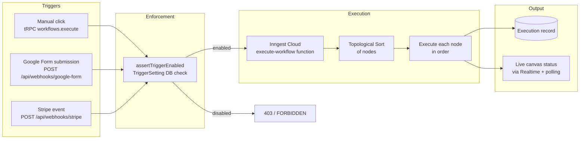

# Application Flow Diagram

> For comprehensive flow details, see:
> - **[../system-design.md](../system-design.md)** — data flows and request lifecycles
> - **[data-flow.md](./data-flow.md)** — detailed execution context and status flows
> - **[sequence-diagram.md](./sequence-diagram.md)** — step-by-step sequence diagrams

## Execution Flow (Summary)



## Subscription Gate Flow

```mermaid
flowchart LR
    User -->|workflows.create<br/>credentials.create| premiumProcedure
    premiumProcedure -->|polarClient.getStateExternal| Polar[Polar.sh]
    Polar -->|activeSubscriptions = []| FORBIDDEN[FORBIDDEN error]
    Polar -->|activeSubscriptions has items| Proceed[Execute procedure]
```
