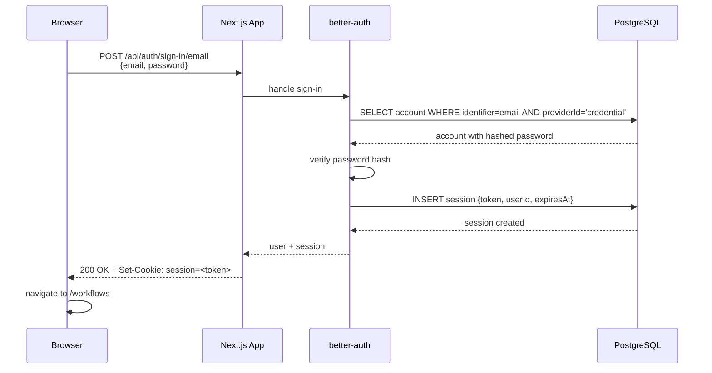
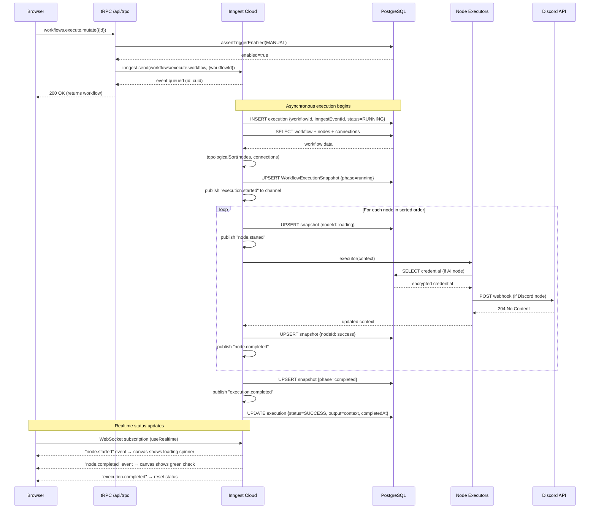
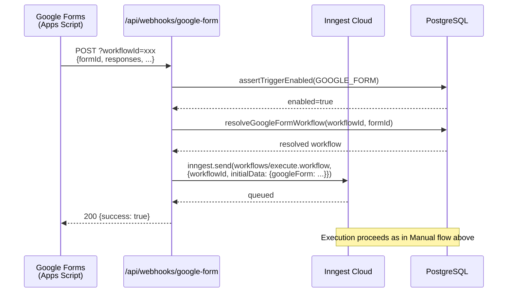
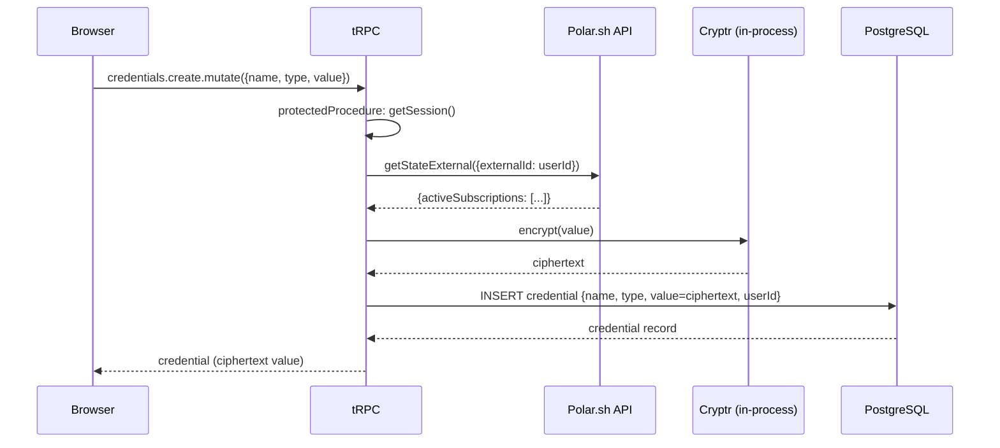
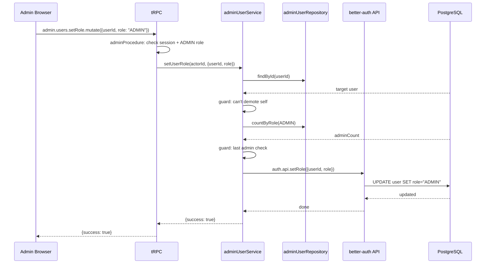

# Sequence Diagrams

## 1. User Authentication (Email/Password)

---

## 2. Manual Workflow Execution

---

## 3. Google Form Webhook Trigger

---

## 4. Credential Creation (Pro User)

---

## 5. Admin Role Change

