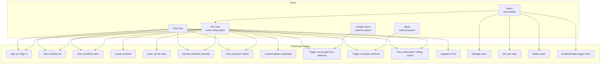

# Use Case Diagram

Actors and their capabilities in FlowForge.

```mermaid
graph TB
    subgraph Actors
        FreeUser[Free User]
        ProUser[Pro User<br/>active subscription]
        Admin[Admin<br/>role=ADMIN]
        GoogleForms[Google Forms<br/>external system]
        Stripe_sys[Stripe<br/>external system]
    end

    subgraph FlowForge["FlowForge System"]
        UC1[Sign up / Sign in]
        UC2[View workflow list]
        UC3[Open workflow editor]
        UC4[Create workflow]
        UC5[Save canvas state]
        UC6[Execute workflow manually]
        UC7[View execution history]
        UC8[Create/Update credentials]
        UC9[Trigger via Google Form webhook]
        UC10[Trigger via Stripe webhook]
        UC11[View subscription / billing portal]
        UC12[Upgrade to Pro]
        UC13[Manage users]
        UC14[Set user roles]
        UC15[Delete users]
        UC16[Enable/Disable trigger kinds]
    end

    FreeUser --> UC1
    FreeUser --> UC2
    FreeUser --> UC3
    FreeUser --> UC6
    FreeUser --> UC7
    FreeUser --> UC11
    FreeUser --> UC12

    ProUser --> UC1
    ProUser --> UC2
    ProUser --> UC3
    ProUser --> UC4
    ProUser --> UC5
    ProUser --> UC6
    ProUser --> UC7
    ProUser --> UC8
    ProUser --> UC9
    ProUser --> UC10
    ProUser --> UC11

    Admin --> UC13
    Admin --> UC14
    Admin --> UC15
    Admin --> UC16
    Admin --> ProUser

    GoogleForms --> UC9
    Stripe_sys --> UC10
```
